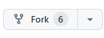
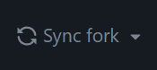
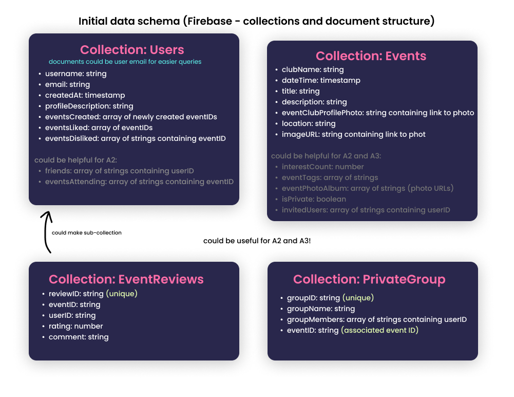

# Contributing Guidelines

## Filing a Bug Report

Simply create a new issue for a bug, and one of us at the VicRoy team will check it out!

In your bug report please include the following if they are applicable:
* A summary of what the bug is
* The observed and expected behaviour
* Steps to reproduce the bug
* Other contextual information (e.g. version and operating environment)
* Screenshots would also be great if possible

## Suggesting a New Feature

We have created a roadmap for the project and what features we would like to add as the project progresses. However, we are always open to new ideas and cool 
suggestions so if you do have a light bulb moment, feel free to send us an email at vroyale374@gmail.com telling us all about it!

## Forking the Repo

After you have set up Android Studio, fork this repo by simply clicking the fork button in the top right of the screen.

From your new forked repo, simply clone the project to your machine.

    Copy the repo URL (click the green "Code" button and copy the link)
    Opening the command prompt
    Navigate to the file that you want the project in
    Enter the command (git clone [repo link])

Now you have a personal copy of RondayView that you can work on!

## Technical Requirements for Contributions

Our backend logic is all in java so please use java and not kotlin!

We also value having a consistent style in our program, this is to minimise confusion and keep everything looking neat and consistent! As such we will be following
googles style guide for java programs shown at this link: https://google.github.io/styleguide/javaguide.html

Also, our branch documentation style is as follows

    Start the branch with one of these tags 

        feat/ - for feature
        fix/ - for bug fix
        test/ - for testing additions
        refactor/ - for refactoring code (not adding anything new)
        docs/ - documentation update

    Then a relevant title for your branch all in lower case with words seperated by dashes (-)

Here is an example of a branch name: feat/creating-home-ui

## Keeping Branches Up To Date

In order to prevent your branches getting out of date, it is important to regularly pull changes from the upstream main branch. The instructions to do this via [rebasing](https://www.atlassian.com/git/tutorials/merging-vs-rebasing) are detailed below:

1) Sync the main branch on your fork with the main branch from the upstream using this button on your fork

2) Then pull these changes to your local main branch using:
`git pull`

3) Then rebase your feature branch with your up to date local main using:
`git rebase main`

4) Git pull to finalise the merge of the remote branch into the feature branch
`git pull`

5) Finally, push your changes to your remote branch using
`git push`

## Submitting a Pull Request

From your local copy of RondayView, make sure all of the changes you make are on a new branch!

After you are happy with all of your changes, do a git push from your branch to github. From your forked repo go into "Pull Requests" in the navbar and click on the green "New Pull Request" button.

Write a short paragraph describing what you have done in the pull request and which issue it addresses.

Select the branch that you want to create the pull request for and GitHub will let you know if there are any merge conflicts. If there are merge conflicts, it will give you some suggestions on how to solve them. Once it is able to merge, you will need to wait for the build and SonarCloud analysis to pass.

From there, one of our team members here at VicRoy will review your pull request and give you some constructive feedback. Once it all looks good to go, we would be honoured to merge your contribution!

## Our Vision

We have put a lot of thought into how we want RondayView to move forward with features, improvements and awesomeness from start to finish with some checkpoints 
in between. We have split the app up into 3 stages and called them A1, A2 and A3, with each stage building upon the former. As such, we would like all features
of A1 to be completed before starting features of A2, and the same for A2 going to A3. We have listed these milestone features below but they are also shown in 
the GitHub issues tab. 

For A1, we would like to cover basic functions of the app. These include the following:
* Create Events – anyone can create events initially and this is stored in database
* Browse Events – anyone can browse events
* Swipe events to show interest or disinterest
* Basic Filter - event dates, event size, virtual or in person
* Basic initial user interface
* User profiles - Sign in, accounts stored in databases

Moving to A2, we would like to build mostly upon the social aspects of the program. The features that we would like to implement are as follows:
* Able to add other user profiles as friends
* View events that friends are going to
* View popular events among all users
* Leaderboard aspect (who has visited the most events)

Finally, at A3, we would like to add features that integrate the project into other aspects of the phone, as well as further cater the app towards individual users with the following features:
* In-app and push notifications for upcoming events
* Link to the phones calendar
* Advanced Filters - Tags / event type, event host name
* Each event gets a photo album that attendees can add to
* Event rating and comments – previous events rating too
* Suggested similar events in event description
* Private Groups and private events

All of these features are detailed more in the GitHub issues tab so you can check them out there too. Feel free to send us an email if you would like to contribute and/or have any questions about a feature.

## High Level Design/Architecture Information

Class Diagram

Initial Firebase Firestore data schema

## Project Ground Rules

We at VicRoy strongly support inclusivity for all peoples as well as fostering a harassment and bully free environment. This means that comments on pull requests should be constructive, helpful and kind. We ask that you avoid condescending words such as "obvious", "easy", or "simply" and avoid making comments personal. Please keep in mind that we are all at different stages in our journey and are all learning. Respect is important to us, so please treat each other as you would like to be treated.

For more information on our policies and ground rules, have a look at out [Code of Conduct](CODE_OF_CONDUCT).

## How to Get in Touch

For any further questions, comments or suggestions, please feel free to email us at vroyale374@gmail.com

## Closing Statements

Thank you for choosing to contribute to our project! We are so glad you could be a part of RondayView and are as passionate about it as we are!

