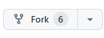

# 310-RondayView

RondayView (pronounced as “Rendezvous”) is an innovative and compelling mobile app designed to transform the way university students discover, connect and engage with university events. It aims to simplify the event exploration process and create an inclusive and vibrant university and campus community.

## Instalation

Have Android Studio installed

Download and follow installation instructions from this link: https://developer.android.com/studio

Please also watch this video for Android Studio setup to make sure your machine is ready to run this project! 
[Setting Up Android Studio](https://www.youtube.com/watch?v=K5z5OIKVmCQ&list=PLg3oSHawmeXjxwAfTM6Ck_Lz55l_P7lnG&index=3&t=1243s)

After you have installed Android Studio, fork this repo by simply clicking the fork button in the top right of the screen.

From your new forked repo, simple clone the project to your machine.

    Copy the repo URL (click the green "Code" button and copy the link)
    Opeining the command prompt
    Navigate to the file that you want the project in
    Enter the command (git clone [repo link])

Now you have a personal copy of RondayView that you can work on!

## Licence

MIT License

Copyright (c) 2023 VicRoy

Permission is hereby granted, free of charge, to any person obtaining a copy
of this software and associated documentation files (the "Software"), to deal
in the Software without restriction, including without limitation the rights
to use, copy, modify, merge, publish, distribute, sublicense, and/or sell
copies of the Software, and to permit persons to whom the Software is
furnished to do so, subject to the following conditions:

The above copyright notice and this permission notice shall be included in all
copies or substantial portions of the Software.

THE SOFTWARE IS PROVIDED "AS IS", WITHOUT WARRANTY OF ANY KIND, EXPRESS OR
IMPLIED, INCLUDING BUT NOT LIMITED TO THE WARRANTIES OF MERCHANTABILITY,
FITNESS FOR A PARTICULAR PURPOSE AND NONINFRINGEMENT. IN NO EVENT SHALL THE
AUTHORS OR COPYRIGHT HOLDERS BE LIABLE FOR ANY CLAIM, DAMAGES OR OTHER
LIABILITY, WHETHER IN AN ACTION OF CONTRACT, TORT OR OTHERWISE, ARISING FROM,
OUT OF OR IN CONNECTION WITH THE SOFTWARE OR THE USE OR OTHER DEALINGS IN THE
SOFTWARE.

## Help

For additional help, questions, or suggestions, please feel free to contact the team at VicRoy by emailing us at vroyale374@gmail.com

## Attributions and Contributing Guidelines

A big thank you to the team and VicRoy that have worked hard on RondayView and brought the project to the community!

    Jackson Schofield
    Ben Martin
    Devesh Duptala
    Ariel Wang
    Emily Zou
    Michael Hardy

Contributing Guidelines can be found here: [Contributing Document](CONTRIBUTING)